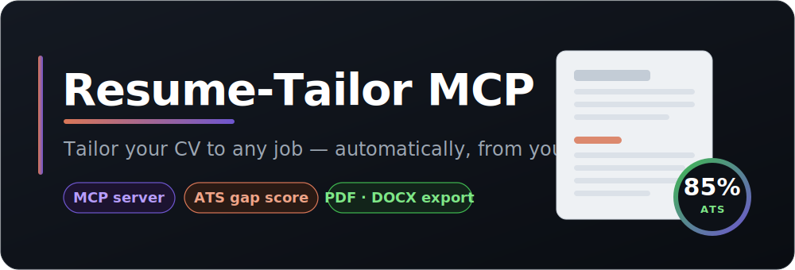

<div align="center">



<br><br>

An open-source **[Model Context Protocol](https://modelcontextprotocol.io)** server that gives
Claude Desktop (or any MCP client) a persistent master résumé, a real ATS keyword score,
and clean PDF / DOCX export.

[](https://nmaaalhawary.github.io/MCP-Resume-Tailor/)
[](https://github.com/NmaaAlhawary/MCP-Resume-Tailor/actions/workflows/ci.yml)
[](LICENSE)
[](https://www.python.org/)
[](https://modelcontextprotocol.io)
[](https://github.com/NmaaAlhawary/MCP-Resume-Tailor/releases)
[](CONTRIBUTING.md)
[](https://claude.ai)

### [🌐 View the live site →](https://nmaaalhawary.github.io/MCP-Resume-Tailor/)

**[Quick start](#installation)** · **[Tools](#tools)** · **[How it works](#how-it-works)** · **[Contributing](#contributing)** · **[Releases](https://github.com/NmaaAlhawary/MCP-Resume-Tailor/releases)**

</div>

---

> **You:** *"Here's a job link — tailor my CV and export a PDF."*
>
> **Claude** reads the posting and your master CV, rewrites it to match, checks the
> ATS keyword score, and hands you a clean file ready to send.

## Table of Contents

- [Why this exists](#why-this-exists)
- [How it works](#how-it-works)
- [Tools](#tools)
- [Installation](#installation)
- [Connect to Claude Desktop](#connect-to-claude-desktop)
- [Usage](#usage)
- [Configuration](#configuration)
- [ATS-safe export](#ats-safe-export)
- [Contributing](#contributing)
- [License](#license)

## Why this exists

Claude can already rewrite a CV in a normal chat. This MCP is worth installing for
the three things a plain chat **can't** do:

| Feature | What it gives you |
|---|---|
| **Persistent master CV** | Stored locally as JSON. Set it up once, reuse it for every job. |
| **Real ATS gap score** | Deterministic keyword math — not vibes. Tells you *exactly* which keywords you're missing. |
| **Clean file export** | ATS-safe PDF / DOCX: single column, standard fonts, real selectable text. |

> [!IMPORTANT]
> **The MCP does not rewrite your CV — Claude does that.** The server supplies the
> persistence, the job fetch, the ATS math, and the export. Claude ties it together.

## How it works

```text
 load_master_resume ─┐                                                  ┌─►  export_resume
                     ├─►  Claude rewrites the CV  ─►  ats_gap_check  ─►──┤
 fetch_job_posting ─►│                                     ▲            └─►  export_cover_letter
 extract_keywords ───┘─────────────────────────────────────┘
```

1. **Load** your master CV — `load_master_resume`
2. **Analyze** the job — `fetch_job_posting` → `extract_keywords`
3. **Rewrite** — *Claude* rewrites the CV to honestly surface the missing keywords
4. **Check** the rewrite — `ats_gap_check` (did the score go up?)
5. **Export** — `export_resume` → a clean PDF or DOCX
6. **Cover letter** *(optional)* — `export_cover_letter` → a matching PDF or DOCX

## Tools

| Tool | Purpose |
|---|---|
| `save_master_resume` | Store/update the base CV (structured JSON: contact, summary, experience, projects, skills, education). |
| `load_master_resume` | Return the stored master CV so Claude can work from it. |
| `fetch_job_posting` | Fetch a job URL → clean text. Falls back to pasted text if the site is blocked or login-walled. |
| `extract_keywords` | Deterministically pull the ranked skills/tools an ATS scans for. |
| `ats_gap_check` | Compare a CV against the job keywords → match score (%) + the exact missing terms. |
| `export_resume` | Render finished CV content (markdown or JSON) → a clean PDF or DOCX. Returns the file path. |
| `export_cover_letter` | Render a finished cover letter → a matching PDF or DOCX. Optionally adds a letterhead (name + contact) from the master CV. Returns the file path. |

## Installation

```bash
git clone git@github.com:NmaaAlhawary/MCP-Resume-Tailor.git
cd MCP-Resume-Tailor

python3 -m venv .venv
source .venv/bin/activate          # fish: source .venv/bin/activate.fish
pip install -r requirements.txt
```

Smoke-test that all seven tools register:

```bash
python -c "import asyncio, server; print([t.name for t in asyncio.run(server.mcp.list_tools())])"
```

> [!NOTE]
> PDF export uses **reportlab** (pure Python — no system libraries needed on
> macOS/Windows/Linux). DOCX export uses **python-docx**.

## Connect to Claude Desktop

Add this to your `claude_desktop_config.json`
(`~/Library/Application Support/Claude/claude_desktop_config.json` on macOS):

```json
{
  "mcpServers": {
    "resume-tailor": {
      "command": "/absolute/path/to/MCP-Resume-Tailor/.venv/bin/python",
      "args": ["/absolute/path/to/MCP-Resume-Tailor/server.py"],
      "env": {
        "RESUME_STORE_PATH": "~/.resume-mcp/master.json"
      }
    }
  }
}
```

Restart Claude Desktop — the seven tools appear under the tools menu.

## Usage

### First-time setup — store your master CV (once)

Copy [`master.template.json`](master.template.json), fill in your details, then ask Claude:

> "Save this as my master resume: *(paste the JSON)*"

Claude calls `save_master_resume` and it persists at `RESUME_STORE_PATH`.

### Everyday flow — tailor to a job

> **You:** Here's a job link — tailor my CV for it and export a PDF:
> `https://example.com/careers/senior-frontend`

Behind the scenes Claude runs:

```text
1. load_master_resume()                          → your stored CV
2. fetch_job_posting(url="…/senior-frontend")    → clean job text
3. extract_keywords(job_text)                    → ["REST APIs", "GraphQL", "TypeScript",
                                                     "Docker", "AWS", "Next.js", "CI/CD", …]
4. ats_gap_check(resume_text, keywords)          → { match_score: 20.0,
                                                     missing: ["GraphQL","Docker","AWS",…] }
5. ── Claude rewrites the CV to surface real, matching skills ──
6. ats_gap_check(new_resume_text, keywords)      → { match_score: 85.0 }
7. export_resume(content=<rewritten>, format="pdf")
                                                 → { path: "~/.resume-mcp/exports/…​.pdf" }
8. export_cover_letter(content=<letter>, format="pdf")
                                                 → { path: "~/.resume-mcp/exports/…​_cover_letter.pdf" }
```

> **Claude:** Tailored your CV — keyword match went from **20% → 85%**. I added your
> Docker/AWS and testing experience to match their stack, and drafted a matching
> cover letter. Exported here:
> `~/.resume-mcp/exports/Jane_Developer_….pdf`
> `~/.resume-mcp/exports/Jane_Developer_…_cover_letter.pdf`

## Configuration

| Env var | Default | Purpose |
|---|---|---|
| `RESUME_STORE_PATH` | `~/.resume-mcp/master.json` | Where the master CV JSON lives. Exports go to `exports/` next to it. |

Everything runs **locally**. No secrets, no external accounts.

## ATS-safe export

- Single column — no text boxes or multi-column tricks that break ATS parsers
- Standard fonts (Calibri / Helvetica)
- Real, selectable text — never image-rendered
- Plain headings and bullet lists that map cleanly to résumé sections

## Contributing

Contributions of any size are welcome. The quickest way in: **fork** the repo,
make your change, and open a pull request.

```bash
# 1. Fork on GitHub, then clone your fork
git clone git@github.com:YOUR-USERNAME/MCP-Resume-Tailor.git
cd MCP-Resume-Tailor

# 2. Set up and branch
python3 -m venv .venv && source .venv/bin/activate
pip install -r requirements.txt
git checkout -b my-improvement

# 3. Change, commit, push
git commit -am "Describe your change"
git push origin my-improvement

# 4. Open a Pull Request on GitHub
```

Great first contributions: add skills to `KNOWN_TERMS` / `KNOWN_PHRASES` in
`server.py`, filter a filler word in `STOPLIST`, or improve the export layout.
See **[CONTRIBUTING.md](CONTRIBUTING.md)** for the full step-by-step guide.

## License

Released under the [MIT License](LICENSE). By contributing, you agree your
contributions are licensed under the same terms.

<div align="center">

**Built by [Nmaa Hawary](https://github.com/NmaaAlhawary)** · If this helped, consider giving it a star.

</div>
